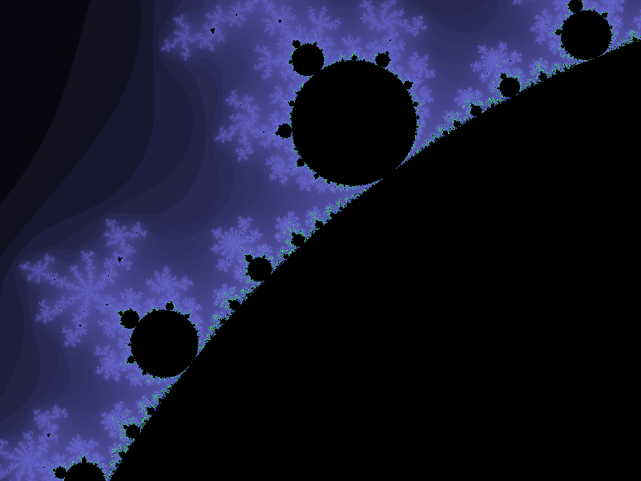
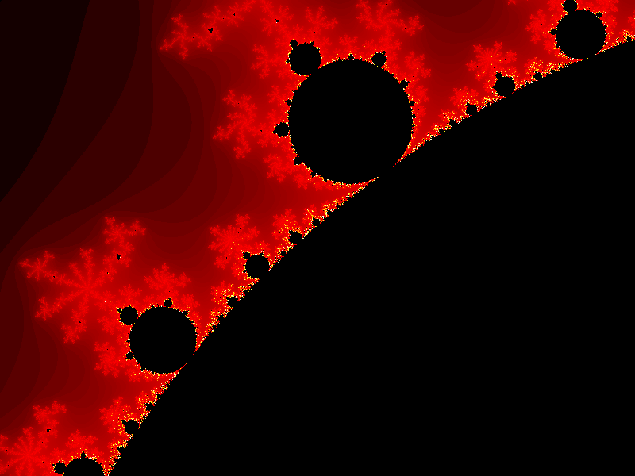
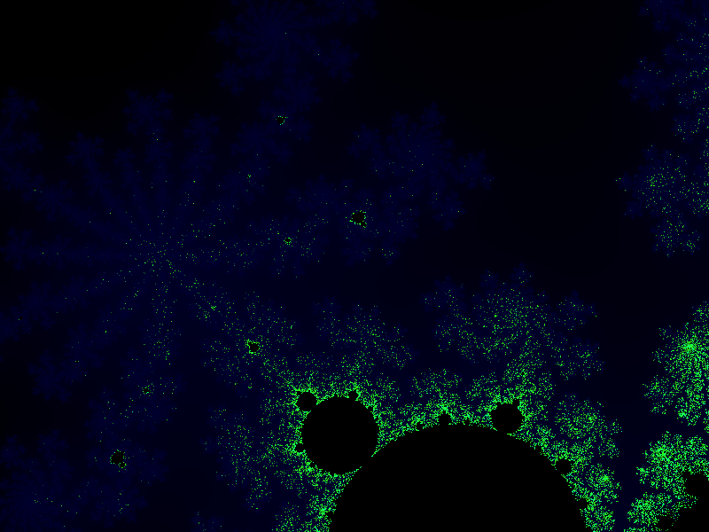

# BitmapFractalGenerator

A complex C++ application.

This is a project from the Udemy course "Learn Advanced C++ Programming" by John Purcell

I used Code::Blocks 16.01 with the default complier to complete this project.

This program will generate the Mandelbrot fractal.  It has a zoom feature that you can comment out to see the fractal normally
or you can uncomment some of the zoom features to go deeper into the fractal.  If you decide you want to zoom further in on a 
different location, load up the image into a photo editor and find the pixel coordinates you want to zoom in on along with the scale you want to use and pass them into the addZoom(xPos, yPos, scale) that is sitting in main.

Here are some example photos of the project:

    You might have figured out at this point that I'm not so good with colors
